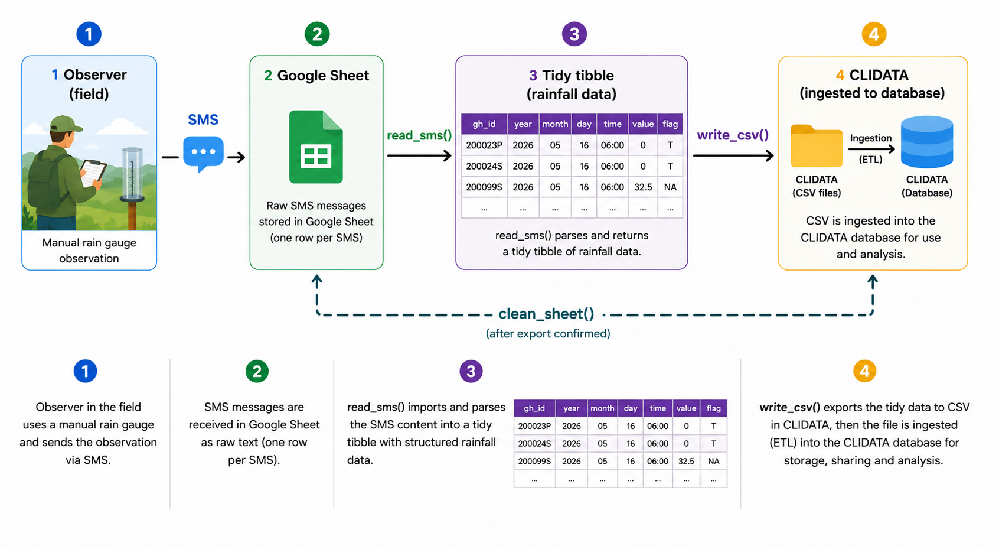

<!-- README.md is generated from README.Rmd. Please edit that file -->

```{r, include = FALSE}
knitr::opts_chunk$set(
  collapse = TRUE,
  comment = "#>",
  fig.path = "man/figures/README-",
  out.width = "100%",
  eval = FALSE
)
```

# smscollectr

<!-- badges: start -->
<!-- badges: end -->

`smscollectr` is an R package designed for the collection, parsing, and export of rain gauge observations transmitted via SMS. It is built for operational use within ANAM.

> **Scope notice** This package is purpose-built for a specific operational context at ANAM-BF: a fixed SMS format, a CLIDATA-compatible output schema, and a Google Sheets-based collection pipeline. It is **not a general-purpose SMS parsing library**. That said, the core functions (`is_gauge_sms()`, `.parse_sms()`, `parse_sms()`) are deliberately modular and can serve as a starting point for adaptation to other networks, SMS formats, or database targets with minimal effort.

## How it works



1.  Field observers send a structured SMS (e.g. `200001S, 03-06-2026, 125`) to a shared number that forwards messages to a Google Sheet.
2.  `read_sms()` reads, validates, and parses all messages into a tidy tibble.
3.  `write_csv()` exports the data as a CSV formatted for direct ingestion into CLIDATA.
4.  `clean_sheet()` wipes the sheet clean after a successful export.


## Installation

You can install the development version of smscollectr from [GitHub](https://github.com/) with:

``` r
# install.packages("pak")
pak::pak("oousmane/smscollectr")
```

## Setup (run once per machine)

Two things need to be configured once before using the package: Google Sheets
authentication and the Sheet URL. Both are stored securely in the system
credential store and never need to be set again.

### 1. Google Sheets authentication

`smscollectr` does not authenticate automatically on load — you must call
`sms_auth()` explicitly at the start of each session. Two modes are supported:

**OAuth** (interactive — suitable for desktop use):

```r
library(smscollectr)

# Run once interactively — opens a browser for Google login.
# The token is cached and reused silently in future sessions.
sms_auth()
```

**Service account** (non-interactive — recommended for servers and automated pipelines):

```r
library(smscollectr)

# Path to the JSON key file downloaded from Google Cloud Console.
# The Sheet must be shared with the service account email.
sms_auth(path = "/secure/path/service-account.json")
```

> A service account never expires and requires no browser interaction — it is
> the preferred solution for operational deployments.

### 2. Store the Sheet URL securely

```r
# Run once — stores the URL in the system keyring (macOS Keychain,
# Windows Credential Manager, or Linux Secret Service).
# Never saved in plain text, .Renviron, or any script.
set_sheet_url("https://docs.google.com/spreadsheets/d/SHEET_ID/edit")
```

After this, `get_sheet_url()` retrieves it anywhere in your code without
exposing the URL.

---

## Quick Start

```r
library(smscollectr)

# Authenticate (once per session)
sms_auth()                                      # OAuth
# sms_auth(path = "/secure/path/key.json")      # Service account

# 1. Read and parse SMS entries
df <- read_sms(sheet_url = get_sheet_url())

# 2. Export for CLIDATA import
readr::write_csv(df, file = "smsexport.csv", na = "")

# 3. Clear the sheet after a successful export
clean_sheet(url = get_sheet_url())
```


## SMS format

Each SMS must follow this structure:

```
XXXXXXY, DD-MM-YYYY, ZZZ
```

| Field | Description | Example |
|---|---|---|
| `XXXXXXY` | 6-digit station ID + type code (`P`, `S`, `A`, or `C`) | `200001S` |
| `DD-MM-YYYY` | Observation date | `03-06-2026` |
| `ZZZ` | Rainfall in tenths of mm, or `TR` for trace | `125` → 12.5 mm |

**Valid examples:**

```
200001S, 03-06-2026, 125     → 12.5 mm at station 200001S on 2026-06-03
200002P, 04-06-2026, TR      → trace rainfall at station 200002P
```

Invalid messages are silently dropped and never appear in the output.

---

## Output format

`read_sms()` returns a tibble with the following columns, ready for CLIDATA import:

| Column | Type | Description |
|---|---|---|
| `eg_gh_id` | character | Station identifier |
| `year` | integer | Observation year |
| `month` | character | Zero-padded month (`"01"` – `"12"`) |
| `day` | character | Zero-padded day (`"01"` – `"31"`) |
| `time` | character | Observation time (always `"06:00"`) |
| `value` | numeric | Rainfall in mm (`0` for trace) |
| `flag` | character | `"T"` for trace, `NA` otherwise |

---

## Security

All sensitive credentials are stored in the **system credential store** via the
[`keyring`](https://keyring.r-lib.org/) package — never in plain text,
`.Renviron`, or committed scripts.

| Secret | Function | When |
|---|---|---|
| Google Sheet URL | `set_sheet_url()` / `get_sheet_url()` | Once per machine |
| OAuth token | Managed by `gargle` via `sms_auth()` | Once per machine |
| Service account key | JSON file at a secure path | Provided by admin |

---

## Functions

| Function | Description |
|---|---|
| `sms_auth()` | Authenticate with Google Sheets (OAuth or service account) |
| `set_sheet_url()` | Store the Sheet URL securely in the system keyring (once) |
| `get_sheet_url()` | Retrieve the stored Sheet URL |
| `is_gauge_sms()` | Check whether a string matches the expected SMS format |
| `read_sms()` | Read, parse, and format SMS entries from a Google Sheet |
| `clean_sheet()` | Delete all data rows from a Google Sheet (preserves header) |

